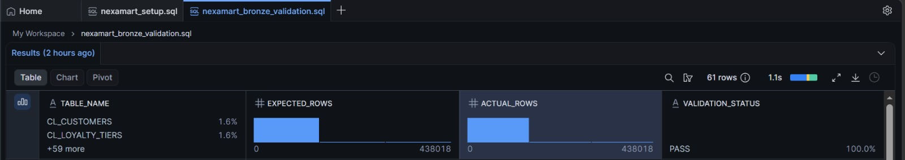
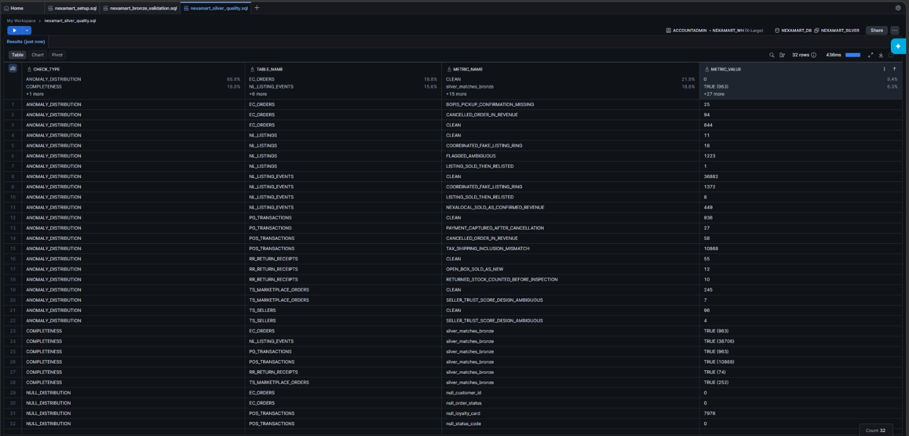

# NEXAMART ENTERPRISE DATA WAREHOUSE

### One Marketplace Many Truths

**ENTERPRISE ARCHITECTURE AND IMPLEMENTATION REPORT**

Bronze Ingestion · Silver Transformation · Gold Dimensional Model

---

| Field | Detail |
|---|---|
| **Project Scope** | End to End Enterprise Data Warehouse Implementation |
| **Execution Role** | Lead Data Engineering Architect |
| **Tech Stack** | Databricks PySpark and Snowflake Enterprise Data Cloud |
| **Architecture** | Bronze to Silver to Gold Medallion Kimball Dimensional Model |
| **Execution Engine** | Fully orchestrated pipeline via master DAG orchestrator |
| **Bronze Layer** | 61 tables ingested 843304 rows 100 percent source to target parity |
| **Silver Layer** | 10 transformation pipelines 16 critical anomalies isolated 8 ambiguous patterns modelled |
| **Gold Layer** | 15 conformed dimensions 14 fact tables 750948 governed rows modelled |

---

[Back to Main](../README.md)

## Table of Contents
1. [Source System Analysis](#1-source-system-analysis)
2. [Schema Discovery Documentation](#2-schema-discovery-documentation)
3. [Bronze Ingestion Strategy](#3-bronze-ingestion-strategy)
4. [Enterprise Bus Matrix](#4-enterprise-bus-matrix)
5. [Grain Declarations](#5-grain-declarations)
6. [Dimensional Model Summary](#6-dimensional-model-summary)
7. [Data Engineering Pipelines](#7-data-engineering-pipelines)
8. [Data Governance and Anomaly Detection](#8-data-governance-and-anomaly-detection)
9. [Project Execution and Delivery](#9-project-execution-and-delivery)

---

## 1 Source System Analysis

The legacy NexaMart operational data landscape comprised 15 disparate source systems encompassing 61 tables, 495 columns, and 843,304 records. Historically architected in strict isolation, these systems suffered from a systemic lack of shared data dictionaries, the complete absence of referential integrity constraints, and highly fragmented temporal formats (six distinct date conventions). Consolidating these silos into a unified Single Source of Truth (SSOT) necessitated rigorous programmatic schema discovery, automated data profiling, and robust engineering interventions.

### 1.1 Customer and Loyalty
**Scope** 3 tables 5365 rows.
**Key Observations** Forms the foundation of cross channel identity. Uncovered customer ID 9999 acting as a critical collision point serving simultaneously as a loyalty account and a guest checkout placeholder. Email and phone domains contained structural inconsistencies requiring E.164 normalisation before identity resolution.

### 1.2 Customer Support
**Scope** 4 tables 391 rows.
**Key Observations** 25 agents handling multi tier support. Date formats limited SLA resolution precision. Identified severe case duplication where omnichannel customer contacts regarding identical incidents generated redundant records requiring canonical deduplication algorithms.

### 1.3 Delivery and Courier
**Scope** 4 tables 4328 rows.
**Key Observations** Five integrated carriers utilizing ISO 8601 timestamps. Isolated temporal impossibilities where DELIVERED timestamps preceded PICKED UP statuses tracing the root cause to courier scanner clock desynchronisation.

### 1.4 Ecommerce Orders
**Scope** 5 tables 6124 rows.
**Key Observations** Native amounts are correctly structured as tax exclusive. Identified critical financial bugs where cancelled orders retained positive total amount values. Detected major attribution gaps requiring a custom clickstream bridge to attribute anonymous web sessions to confirmed transactional orders.

### 1.5 NexaLocal Classified
**Scope** 5 tables 40342 rows.
**Key Observations** Peer to peer marketplace with extensive engagement events. Seller declared sold events were falsely inflating corporate revenue in legacy reporting. Uncovered coordinated fraud rings requiring heuristic detection via image hash clustering and creation proximity analysis.

### 1.6 Product Catalogue
**Scope** 5 tables 132 rows.
**Key Observations** 65 active SKUs operating as the canonical truth for margin calculations. Detected identity mapping failures where distinct products shared identical SKUs enforcing strict NexaMart catalog precedence in the Silver layer to resolve conflicts.

### 1.7 Payment Gateway
**Scope** 3 tables 983 rows.
**Key Observations** All timestamp columns stored as UNIX Epoch integers requiring explicit casting. Discovered captured payments on cancelled orders representing immediate unrecognized refund liabilities.

### 1.8 POS and Store Checkout
**Scope** 6 tables 35568 rows.
**Key Observations** 10868 transaction headers across physical stores. Amounts were natively tax inclusive causing severe structural mismatch with Ecommerce ledgers. Isolated cancelled POS transactions carrying false positive revenue.

### 1.9 Returns and Refunds
**Scope** 4 tables 234 rows.
**Key Observations** Detected severe inventory governance failures where returned products bypassed QA inspection directly re entering the sellable pool and open box items improperly merged with new inventory pools.

### 1.10 Reviews and Ratings
**Scope** 1 table 377 rows.
**Key Observations** Flagged logic failures where product reviews carried submission timestamps prior to courier delivery confirmation requiring programmatic invalidation of the verified purchase flags.

### 1.11 Store Inventory
**Scope** 3 tables 654673 rows.
**Key Observations** Largest system representing 52 percent of the database. Flagged mathematically impossible negative ATP rows. Identified total data outages for specific stores requiring the deployment of a forward fill algorithmic reconstruction engine to generate gap fill records.

### 1.12 Marketplace and Trust Safety
**Scope** 10 tables 1524 rows.
**Key Observations** 100 third party sellers. Enforced strict differentiation between Fulfilled by NexaMart and Seller Fulfilled logistics to prevent double counting warehouse stock. Engineered automated risk scoring to route high risk sellers for suspension.

### 1.13 Warehouse and Fulfilment
**Scope** 5 tables 69119 rows.
**Key Observations** Three regional fulfilment centres. Flagged oversell risks where systems showed positive ATP against zero physical stock. Modelled ambiguous unreferenced inventory movements using 24 hour temporal proximity heuristics.

### 1.14 Web Clickstream
**Scope** 3 tables 24144 rows.
**Key Observations** Full UTM attribution funnel. Engineered the attribution bridge to map anonymous clickstream sessions to confirmed transactional orders within a strict rolling 120 minute window.

### 1.15 Cross System Integration Notes
**Key Observations** Established deterministic joins across fundamentally disjointed systems. NexaLocal identities resolved via MD5 hashed PII. All 69 foreign key relationships logically inferred and enforced via data engineering as the source instance lacked referential constraints.

---

## 2 Schema Discovery Documentation

The operational source systems entirely lacked enforced foreign key constraints at the database level. Relational integrity and logical architectures had to be reverse-engineered from scratch utilizing programmatic discovery heuristics.

### 2.1 Discovery Methodology
* **Pattern Matching:** Traced column naming conventions and domain ontology across isolated schemas.
* **Value Intersection Analysis:** Sampled domain records per candidate Foreign Key (FK) and cross-referenced unique value sets against claimed Primary Key (PK) tables to definitively prove cardinality and relationship validity.
* **Orphan Row Detection:** Executed programmatic `LEFT JOIN` coverage checks, identifying severe referential integrity breaks across distributed downstream systems.

### 2.2 Notable Structural Discoveries
**Cross System Order Joins** Payment and shipment systems joined to ecommerce via STRING fields not integers.
**Dual Purpose Identity** Discovered a single integer serving as both a real loyalty account and a system wide guest checkout placeholder.
**FBN Stock Isolation** Identified third party stock within warehouse snapshots architecting logic to exclude it from core ATP calculations preventing inflated liquidity reporting.

---

## 3 Bronze Ingestion Strategy

The Bronze data lake layer preserves the raw operational data with strict zero-mutation guarantees, providing an immutable audit trail for downstream compliance. Technical metadata columns (e.g., `_ingest_timestamp`, `_source_file`) were injected at runtime to enforce strict data lineage tracking.

| Metric | Value | Metric | Value |
|---|---|---|---|
| Total Tables Ingested | 61 / 61 | Status OK | 60 tables |
| Total Rows Ingested | 843304 | Status EMPTY OK | 1 table |
| Source to Target Mismatches | 0 | Ingestion Mode | OVERWRITE Idempotent |
| Target Warehouse | NEXAMART WH | DB Connector | Snowflake JDBC |

> **Notebook Evidence:** [`bronze-ingestion-m1.html`](../NexaMart-M1-M2%20(html)/bronze-ingestion-m1.html)

*Figure 1: Snowflake Bronze layer schema and row count validation, proving 100% source-to-target ingestion parity with zero data mutations.*

Massive tables were programmatically chunked into segments via custom functions to prevent JDBC timeout constraints ensuring robust production grade execution.

---

## 4 Enterprise Bus Matrix

Designed to align fragmented source systems into a unified analytical architecture enabling complex cross process analysis.
Y indicates dimension participates in this fact process.

| Fact Table | Date | Product | Store | Cust | Seller | Promo | Channel | Payment | Delivery | Cond | RetRsn | Step | Risk |
|---|:---:|:---:|:---:|:---:|:---:|:---:|:---:|:---:|:---:|:---:|:---:|:---:|:---:|
| fact store sale line | Y | Y | Y | Y | | Y | Y | Y | | Y | | | |
| fact ecommerce order line | Y | Y | | Y | | Y | Y | Y | Y | Y | | | |
| fact return line | Y | Y | Y | Y | | | Y | | Y | Y | Y | | |
| fact store inventory snap | Y | Y | Y | | | | | | | Y | | | |
| fact warehouse inventory snap | Y | Y | | | Y | | | | | Y | | | |
| fact inventory transaction | Y | Y | Y | | | | | | | | | | |
| fact order fulfilment | Y | | | Y | | | Y | | Y | | | | |
| fact web session | Y | | | Y | | Y | Y | | | | | | |
| fact web page event | Y | | | Y | | Y | Y | | | | | Y | |
| fact classified listing event | Y | Y | | Y | Y | | Y | | | Y | | | Y |
| fact classified listing snap | Y | Y | | Y | Y | | | | | Y | | | Y |
| fact seller performance snap | Y | | | | Y | | | | | | | | Y |
| fact customer review | Y | Y | Y | Y | Y | | Y | | | Y | | | |
| fact customer complaint | Y | | Y | Y | Y | | Y | | | | | | |

---

## 5 Grain Declarations

Strict grain declarations were established to prevent dimensional modelling errors and ensure analytical accuracy.

| Fact Table | Grain Declaration |
|---|---|
| fact store sale line | One row represents one product SKU scanned on one POS receipt at one physical store. |
| fact ecommerce order line | One row represents one product SKU on one ecommerce order. |
| fact return line | One row represents one product returned on one return authorisation. |
| fact store inventory snap | One row represents the end of day inventory position for one SKU at one physical store on one calendar date. |
| fact warehouse inventory snap | One row represents the end of day inventory position for one SKU at one regional fulfilment centre on one calendar date. |
| fact inventory transaction | One row represents one inventory movement event. |
| fact order fulfilment | One row represents the complete fulfilment lifecycle of one ecommerce order. |
| fact web session | One row represents one web or mobile app session. |
| fact web page event | One row represents one page interaction event within a web or app session. |
| fact classified listing event | One row represents one engagement event on one NexaLocal classified listing. |
| fact classified listing snap | One row represents the daily state of one active NexaLocal listing. |
| fact seller performance snap | One row represents the weekly performance aggregation of one marketplace seller. |
| fact customer review | One row represents one customer review submission. |
| fact customer complaint | One row represents one canonical support case deduplicated via canonical case ref. |

---

## 6 Dimensional Model Summary

The Gold layer surfaces a robust, enterprise-grade Kimball Dimensional Model. 15 Conformed Dimensions and 14 Fact Tables were instantiated from the highly curated Silver layer. All logical relationships are enforced utilizing deterministic SHA-256 hash surrogate keys, ensuring cross-environment idempotency. To enforce strict data governance and executive trust, every fact table explicitly carries a `metric_certainty_level` (e.g., CONFIRMED, ESTIMATED).

### 6.1 Conformed Dimensions

| Dimension Table | SCD | Rows | Key Attributes |
|---|---|---|---|
| dim date | Static | 366 | Calendar date fiscal period role played across all date FKs. |
| dim product | SCD2 | 65 | Canonical SKU 3 level hierarchy standard cost. |
| dim store | SCD1 | 20 | Store name region format campaign zone. |
| dim customer | SCD2 | 2544 | Best known name loyalty tier identity confidence score. |
| dim seller | SCD1 | 456 | B2B sellers P2P sellers seller risk score. |
| dim promotion | SCD1 | 2 | Promotion type campaign association flag. |
| dim channel | Static | 5 | Channel group enables BOPIS BORIS analytics. |
| dim payment method | Static | 18 | Payment type provider payment certainty flag. |
| dim delivery method | Static | 5 | Method name SLA min max days. |
| dim listing condition | Static | 10 | Product condition at time of listing. |
| dim return reason | Static | 12 | Reason code channel fault attribution. |
| dim step | Static | 17 | Customer journey step funnel stage. |
| dim seller risk tier | SCD1 | 5 | Verified Trusted to Suspended. |
| dim warehouse | Static | 3 | Capacity and regional attributes. |
| dim movement type | Static | 22 | Store and warehouse movement unified taxonomy. |

### 6.2 Fact Tables

| Fact Table | Type | Rows | Key Facts |
|---|---|---|---|
| fact ec order | Transaction | 963 | subtotal tax campaign attribution ncr safe amount |
| fact ec order line | Transaction | 1840 | quantity unit price discount line total |
| fact pos transaction | Transaction | 10868 | sub total tax total amount incl tax |
| fact pos transaction line | Transaction | 24507 | quantity unit price discount line total |
| fact payment | Transaction | 963 | amount charged refund payment status |
| fact delivery | Transaction | 771 | SLA compliance carrier delta days |
| fact return | Transaction | 74 | returned qty original channel return channel |
| fact refund | Transaction | 74 | refund amount revenue impact |
| fact review | Transaction | 377 | star rating review type verified purchase |
| fact support case | Transaction | 129 | complaint category resolution outcome fault |
| fact web session | Transaction | 3370 | session duration page count cart abandoned |
| fact web page event | Transaction | 20757 | event type time on page utm campaign |
| fact store inventory snap | Periodic | 217800 | physical qty sellable qty atp reconstructed |
| fact inventory movement | Transaction | 468455 | quantity change movement type |

Total Gold rows modelled 750948 across 14 fact tables and 3550 across 15 dimension tables.

---

## 7 Data Engineering Pipelines

The Silver layer serves as the heavily curated enterprise integration hub. We engineered 10 modular PySpark pipelines executing complex data standardisation, multi-pass identity resolution, and advanced heuristic algorithmic modelling. Every output record in the Silver layer is bound to strict data quality governance flags (e.g., `is_anomaly`, `dq_status`).

**T1 Temporal Standardisation** Parsed disparate date formats into strict ISO 8601 UTC.
**T2 State Normalisation** Mapped fragmented legacy status codes into a unified canonical taxonomy.
**T3 Idempotent Identity Generation** Implemented deterministic SHA 256 surrogate keys ensuring pipeline idempotency.
**T4 Customer Identity Resolution** Built a 4 pass algorithmic matching engine executing exact deterministic matching followed by Jaccard similarity probabilistic matching.
**T5 Product Master Reconciliation** Designed a word overlap fuzzy matching algorithm linking unstandardised third party listings back to the canonical master catalog.
**T6 Inventory ATP Algorithmic Reconstruction** Engineered a temporal forward fill pipeline bridging critical data outages mathematically.
**T7 Classified Listing Confidence Engine** Programmed a 5 component weighted heuristics engine to assign programmatic confidence scores to listings.
**T9 Campaign Attribution Bridge** Built a strict time series attribution bridge correlating anonymous web clickstream sessions to confirmed transactional orders.
**T10 Seller Trust Risk Scoring** Implemented an algorithmic risk model mapping seller behaviors into actionable risk tiers.

> **Notebook Evidence:** [`silver-transactions-m1.html`](../NexaMart-M1-M2%20(html)/silver-transactions-m1.html) | [`silver-inventory-m1.html`](../NexaMart-M1-M2%20(html)/silver-inventory-m1.html) | [`silver-customer-m1.html`](../NexaMart-M1-M2%20(html)/silver-customer-m1.html) | [`silver-classified-m1.html`](../NexaMart-M1-M2%20(html)/silver-classified-m1.html) | [`silver-sellers-m1.html`](../NexaMart-M1-M2%20(html)/silver-sellers-m1.html) | [`silver-product-m1.html`](../NexaMart-M1-M2%20(html)/silver-product-m1.html)

*Figure 2: PySpark Silver layer output demonstrating the successful application of the `anomaly_flag` and `dq_status` columns, enforcing the Zero Deletion policy.*

---

## 8 Data Governance and Anomaly Detection

A core architectural directive was the enforcement of a "Zero Data Deletion" policy. Structurally malformed or logically ambiguous data was programmatically quarantined, flagged, and passed downstream for auditing without dropping rows. During the Silver layer execution, the pipeline successfully identified and isolated 16 critical structural bugs (Category A) and 8 ambiguous business logic patterns (Category B). Full remediation details are available in the Phase 2 Resolution Report.

---

## 9 Project Execution and Delivery

The deployment of the NexaMart Enterprise Data Warehouse successfully decoupled corporate analytics from fragmented operational silos, processing over 840,000 discrete transactional records into a highly governed, infinitely scalable Kimball dimensional model.

**Phase 1 Execution** The orchestrated pipeline successfully extracts raw SQLite data into the Snowflake Bronze data lake curates it through complex PySpark transformations into Silver and dynamically builds the dimensional models into Gold.
**Phase 2 Execution** Resolution of all quarantined Silver anomalies and the deployment of final stakeholder KPI dashboards.
